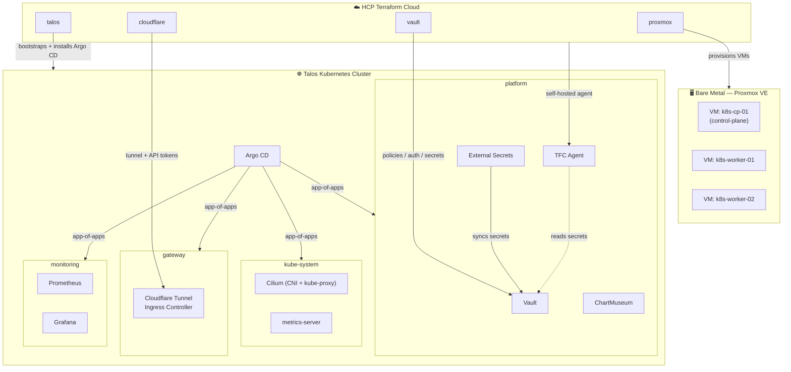

# 0xk3m Homelab

A fully GitOps-driven homelab running a bare-metal Kubernetes cluster on [Talos Linux](https://www.talos.dev/), provisioned end-to-end with Terraform and continuously delivered with Argo CD. Infrastructure, secrets, networking, and observability are all declarative and version-controlled in this single repository.

> Domain: `0xk3m.dev` · Everything from the hypervisor up is codified — no manual `kubectl apply`, no secrets in Git.

---

## Architecture



### The stack, layer by layer

| Layer | Technology | Purpose |
|-------|-----------|---------|
| **Hypervisor** | Proxmox VE 9.x | Runs the cluster VMs on a single 12th-gen Intel node |
| **OS** | Talos Linux | Immutable, API-driven Kubernetes OS (no SSH, no shell) |
| **IaC** | Terraform + HCP Terraform Cloud | Declarative provisioning across 4 workspaces, executed by a self-hosted agent inside the cluster |
| **Secrets** | HashiCorp Vault + External Secrets Operator | Single source of truth for all secrets; synced into K8s and read by Terraform |
| **GitOps** | Argo CD (app-of-apps) | Every workload is reconciled from this repo |
| **Networking** | Cilium + Cloudflare Tunnel | eBPF CNI (replaces kube-proxy) + zero-trust ingress with no exposed ports |
| **Observability** | Prometheus + Grafana | Cluster metrics and dashboards |
| **Registry** | ChartMuseum | Private Helm chart repo at `charts.0xk3m.dev` |

---

## Repository layout

```
.
├── terraform/                  # Infrastructure as Code (HCP Terraform Cloud)
│   ├── proxmox/                #   → provisions Talos VMs (bpg/proxmox)
│   ├── talos/                  #   → bootstraps K8s cluster + installs Argo CD
│   ├── cloudflare/             #   → Zero Trust tunnel + scoped API tokens
│   └── vault/                  #   → Vault config (modular: auth, policy, secrets, k8s, audit, identity)
│
├── kubernetes/                 # GitOps source of truth (reconciled by Argo CD)
│   ├── bootstrap/root.yaml     #   → root "app-of-apps" entrypoint
│   ├── projects/               #   → Argo CD AppProjects + ApplicationSets
│   └── apps/                   #   → workloads grouped by project
│       ├── platform/           #     vault, external-secrets, chartmuseum, terraform-agent
│       ├── kube-system/        #     cilium, metrics-server
│       ├── gateway/            #     cloudflare-tunnel-ingress-controller
│       └── monitoring/         #     prometheus, grafana
│
└── charts/                     # Reusable in-house Helm charts (published to ChartMuseum)
    ├── app/                    #   → generic app chart (deploy/svc/ingress/httproute/hpa/externalsecret)
    ├── external-secret-helper/ #   → ExternalSecret templating
    └── external-secret-store/  #   → (Cluster)SecretStore templating
```

---

## How it works

### 1. Provisioning (Terraform → HCP Terraform Cloud)

Four workspaces run remotely on HCP Terraform Cloud, executed by a **self-hosted `tfc-agent` running inside the cluster** so runs can reach the private homelab network:

- **`proxmox`** — creates the Talos VMs on Proxmox (`bpg/proxmox`).
- **`talos`** — generates Talos machine config, bootstraps the cluster, and installs Argo CD via Helm. Talos is configured with **no default CNI and no kube-proxy** — Cilium takes over both.
- **`cloudflare`** — manages the Zero Trust tunnel and least-privilege API tokens.
- **`vault`** — configures Vault declaratively through purpose-built modules (`auth` for Google OIDC, `policy`, `secrets` for KV v2, `identity`, `audit`, `k8s_auth`).

All workspace secrets are pulled from Vault at plan/apply time (`secret/terraform/*`) rather than living in `.tfvars`.

### 2. Secrets (Vault + External Secrets Operator)

Vault (KV v2 at `secret/`) is the single source of truth. Two consumers:

- **Terraform** reads `secret/terraform/{cloudflare,proxmox,talos}` via the Vault provider using a scoped `terraform-reader` token.
- **External Secrets Operator** syncs Vault paths into native Kubernetes `Secret`s through a `ClusterSecretStore` (`vault-backend`) authenticated with the Kubernetes auth method (role `eso`).

No plaintext secrets are committed — workloads reference an `ExternalSecret`, and ESO materializes the real value at runtime.

### 3. Delivery (Argo CD app-of-apps)

A single root `Application` (`kubernetes/bootstrap/root.yaml`) points at `kubernetes/projects/`, which defines one `AppProject` + `ApplicationSet` per domain. Each `ApplicationSet` uses a **Git file generator** that discovers apps from `kubernetes/apps/<project>/*/config.json` — so adding a new app is just committing a folder with a `config.json`, `Chart.yaml`, and `values.yaml`. Argo CD self-heals and prunes automatically.

---

## Screenshots

| HCP Terraform Cloud workspaces | Proxmox VE host |
|:---:|:---:|
|  |  |

| Argo CD applications | Grafana cluster dashboard |
|:---:|:---:|
|  |  |

---

## Design principles

- **Everything as code** — from VM creation to Grafana, nothing is clicked into existence.
- **Secrets never touch Git** — Vault is authoritative; ESO and the Vault Terraform provider fetch on demand.
- **GitOps by default** — `git push` is the deployment mechanism; Argo CD reconciles the rest.
- **Zero-trust ingress** — no ports are exposed; all inbound traffic arrives through a Cloudflare Tunnel.
- **Immutable nodes** — Talos has no shell or package manager; the cluster is reproducible from config alone.

---

## Tech stack

`Proxmox VE` · `Talos Linux` · `Kubernetes` · `Terraform` · `HCP Terraform Cloud` · `HashiCorp Vault` · `External Secrets Operator` · `Argo CD` · `Cilium` · `Cloudflare Tunnel` · `Gateway API` · `Prometheus` · `Grafana` · `ChartMuseum` · `Helm`
